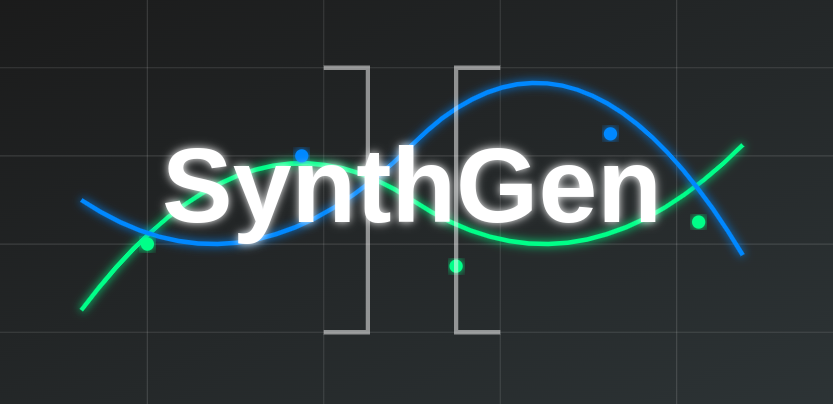

# SynthGen - Package for Generating  Raw, Instruction, and Preference Synthetic Datasets.



SynthGen is a package for generating Synthetic Raw, Instruction, and Preference Datasets. The idea is to have a tool which is simple to use and can generate datasets on different topics by utilizing LLMs from different API providers. The package is designed to be modular and can be easily extended to include some different API providers for LLMs and new features.

## Why SynthGen now? 🤔

Interest in synthetic data generation has surged recently, driven by the growing recognition of data as a critical asset in AI development. As Ilya Sutskever, one of the most important figures in AI, says: 'Data is the fossil fuel of AI.' The more quality data we have, the better our models can perform. However, access to data is often restricted due to privacy concerns, or it may be prohibitively expensive to collect. Additionally, the vast amount of high-quality data on the internet has already been extensively mined. Synthetic data generation addresses these challenges by allowing us to create diverse and useful datasets using current pre-trained Large Language Models (LLMs). Beyond LLMs, synthetic data also holds immense potential for training and fine-tuning Small Language Models (SLMs), which are gaining popularity due to their efficiency and suitability for specific, resource-constrained applications. By leveraging synthetic data for both LLMs and SLMs, we can enhance performance across a wide range of use cases while balancing resource efficiency and model effectiveness. This approach enables us to harness the strengths of both synthetic and authentic datasets to achieve optimal outcomes.

## Tools used for building SynthGen 🧰

The package is built using Python and the following libraries:
- [uv](https://docs.astral.sh/uv/), An extremely fast Python package and project manager, written in Rust.
- [litellm](https://docs.litellm.ai/docs/), A Python SDK for accessing LLMs from different API providers with standardized OpenAI Format.
- [langfuse](https://langfuse.com/), LLMOps platform for observability, tracebility and monitoring of LLMs.
- [pydantic](https://pydantic-docs.helpmanual.io/), Data validation and settings management using Python type annotations.
- [huggingface-hub](https://huggingface.co/) & [datasets](https://huggingface.co/docs/datasets/), A Python library for saving generated datasets on Hugging Face Hub.

## Requirements 📋

To use the package, you need to have the following requirements installed:
- [Python 3.10+](https://www.python.org/downloads/)
- [uv](https://docs.astral.sh/uv/) for building the package directly from the source code
- [Ollama](https://ollama.com/) running on your local machine if you want to use Ollama as an API provider (optional)
- [Langfuse](https://langfuse.com/) running on your local machine or in the cloud if you want to use Langfuse for tracebility (optional)
- [Hugging Face Hub](https://huggingface.co/) account if you want to save the generated datasets on Hugging Face Hub with generated token (optional)

## Installation 🛠️

To install the package, you can use the following command:

```bash
pip install synthgen
```

or you can install the package directly from the source code using the following command:

```bash
uv build
pip install ./dist/synthgen-{version}-py3-none-any.whl
```

## Usage 👨‍💻

### Quick Start 🏃

The available API providers for LLMs are:
- **Groq**
- **Mistral AI**
- **Gemini**
- **Bedrock**
- **Anthropic**
- **OpenAI**
- **Hugging Face**
- **Ollama**

For observing the generated datasets, you can use **Langfuse** for tracebility and monitoring of the LLMs.

To use the LLMs from different API providers, to observe the generated datasets, and to save the generated datasets on Hugging Face Hub, you need to set the following environment variables:
```
# API keys for different LLM providers
GROQ_API_KEY=
MISTRAL_API_KEY=
GEMINI_API_KEY=
AWS_ACCESS_KEY_ID=
AWS_SECRET_ACCESS_KEY=
AWS_REGION=
AWS_PROFILE=
ANTHROPIC_API_KEY=
OPENAI_API_KEY=
HUGGINGFACE_API_KEY=

# Langfuse API keys
LANGFUSE_PUBLIC_KEY=
LANGFUSE_SECRET_KEY=
LANGFUSE_HOST=

# Huggingface token for uploading datasets on Huggingface
HF_TOKEN=
```

Currently there are three types of datasets that can be generated using SynthGen:
- **Raw Datasets**
- **Instruction Datasets**
- **Preference Datasets**

The datasets can be generated:
- **Synchronously** - each dataset entry is generated one by one
- **Asynchronously** - batch of dataset entries is generated at once

> [!NOTE]
> Asynchronous generation is faster than synchronous generation, but some of LLM providers can have limitations on the number of tokens that can be generated at once.

#### Raw Datasets 🟢

To generate a raw dataset, you can use the following code:

```python
import os

from synthgen import (
    DatasetConfig,
    DatasetGeneratorConfig,
    LLMConfig,
    RawDatasetGenerator,
)

# Setting the API keys
os.environ["LLM_API_KEY"] = ""

# Optional for Langfuse Tracebility
os.environ["LANGFUSE_SECRET_KEY"] = ""
os.environ["LANGFUSE_PUBLIC_KEY"] = ""
os.environ["LANGFUSE_HOST"] = ""

# Optional for Hugging Face Hub upload
os.environ["HF_TOKEN"] = ""

# Creating the LLMConfig
llm_config = LLMConfig(
    model="model_provider/model_name", # Check liteLLM docs for more info 
    temperature=0.5,
    top_p=0.9,
    max_tokens=2048,
)

# Creating the DatasetConfig
dataset_config = DatasetConfig(
    topic="topic_name",
    domains=["domain1", "domain2"],
    language="English",
    additional_description="Additional description",
    num_entries=1000
)

# Creating the DatasetGeneratorConfig
dataset_generator_config = DatasetGeneratorConfig(
    llm_config=llm_config,
    dataset_config=dataset_config,
)

# Creating the RawDatasetGenerator
raw_dataset_generator = RawDatasetGenerator(dataset_generator_config)

# Generating the dataset
raw_dataset = raw_dataset_generator.generate_dataset()

# Generating the dataset asynchroniously
# raw_dataset = raw_dataset_generator.agenerate_dataset()

# Name of the Hugging Face repository where the dataset will be saved
hf_repo_name = "organization_or_user_name/dataset_name" # optional

# Saving the dataset to the locally and to the Hugging Face repository(optional)
dataset.save_dataset(
    hf_repo_name=hf_repo_name,
)
```

Example of generated entry for the raw dataset:

```json
{
    "keyword": "keyword",
    "topic": "topic",
    "language": "language",
    "generated_text":
    {
        "text": "generated text"
    }
}
```

#### Instruction Datasets 💬

To generate an instruction dataset, you can use the following code:

```python
import os

from synthgen import (
    DatasetConfig,
    DatasetGeneratorConfig,
    LLMConfig,
    InstructionDatasetGenerator,
)

# Setting the API keys
os.environ["LLM_API_KEY"] = ""

# Optional for Langfuse Tracebility
os.environ["LANGFUSE_SECRET_KEY"] = ""
os.environ["LANGFUSE_PUBLIC_KEY"] = ""
os.environ["LANGFUSE_HOST"] = ""

# Optional for Hugging Face Hub upload
os.environ["HF_TOKEN"] = ""

# Creating the LLMConfig
llm_config = LLMConfig(
    model="model_provider/model_name", # Check liteLLM docs for more info 
    temperature=0.5,
    top_p=0.9,
    max_tokens=2048,
)

# Creating the DatasetConfig
dataset_config = DatasetConfig(
    topic="topic_name",
    domains=["domain1", "domain2"],
    language="English",
    additional_description="Additional description",
    num_entries=1000
)

# Creating the DatasetGeneratorConfig
dataset_generator_config = DatasetGeneratorConfig(
    llm_config=llm_config,
    dataset_config=dataset_config,
)

# Creating the InstructionDatasetGenerator
instruction_dataset_generator = InstructionDatasetGenerator(dataset_generator_config)

# Generating the dataset
instruction_dataset = instruction_dataset_generator.generate_dataset()

# Generating the dataset asynchroniously
# instruction_dataset = instruction_dataset_generator.agenerate_dataset()

# Name of the Hugging Face repository where the dataset will be saved
hf_repo_name = "organization_or_user_name/dataset_name" # optional

# Saving the dataset to the locally and to the Hugging Face repository(optional)
dataset.save_dataset(
    hf_repo_name=hf_repo_name,
)
```

Example of generated entry for the instruction dataset:

```json
{
    "keyword": "keyword",
    "topic": "topic",
    "language": "language",
    "generated_text":
    {
        "messages": [
            {
                "role": "system",
                "content": "generated system (instruction) prompt"
            },
            {
                "role": "user",
                "content": "generated user prompt"
            },
            {
                "role": "assistant",
                "content": "generated assistant prompt"
            }
        ]
    }
}
```

#### Preference Datasets 🌟

To generate a preference dataset, you can use the following code:

```python
import os

from synthgen import (
    DatasetConfig,
    DatasetGeneratorConfig,
    LLMConfig,
    PreferenceDatasetGenerator,
)

# Setting the API keys
os.environ["LLM_API_KEY"] = ""

# Optional for Langfuse Tracebility
os.environ["LANGFUSE_SECRET_KEY"] = ""
os.environ["LANGFUSE_PUBLIC_KEY"] = ""
os.environ["LANGFUSE_HOST"] = ""

# Optional for Hugging Face Hub upload
os.environ["HF_TOKEN"] = ""

# Creating the LLMConfig
llm_config = LLMConfig(
    model="model_provider/model_name", # Check liteLLM docs for more info 
    temperature=0.5,
    top_p=0.9,
    max_tokens=2048,
)

# Creating the DatasetConfig
dataset_config = DatasetConfig(
    topic="topic_name",
    domains=["domain1", "domain2"],
    language="English",
    additional_description="Additional description",
    num_entries=1000
)

# Creating the DatasetGeneratorConfig
dataset_generator_config = DatasetGeneratorConfig(
    llm_config=llm_config,
    dataset_config=dataset_config,
)

# Creating the PreferenceDatasetGenerator
preference_dataset_generator = PreferenceDatasetGenerator(dataset_generator_config)

# Generating the dataset
preference_dataset = preference_dataset_generator.generate_dataset()

# Generating the dataset asynchroniously
# preference_dataset = preference_dataset_generator.agenerate_dataset()

# Name of the Hugging Face repository where the dataset will be saved
hf_repo_name = "organization_or_user_name/dataset_name" # optional

# Saving the dataset to the locally and to the Hugging Face repository(optional)
dataset.save_dataset(
    hf_repo_name=hf_repo_name,
)
```

Example of generated entry for the preference dataset:

```json
{
    "keyword": "keyword",
    "topic": "topic",
    "language": "language",
    "generated_text":
    {
        "messages": [
            {
                "role": "system",
                "content": "generated system (instruction) prompt",
                "option": null
            },
            {
                "role": "user",
                "content": "generated user prompt",
                "option": null
            },
            {
                "role": "assistant",
                "content": "chosen assistant response",
                "option": "chosen"
            },
            {
                "role": "assistant",
                "content": "rejected assistant response",
                "option": "rejected"
            }
        ]
    }
}
```

#### More Examples 📖

More examples with different combinations of LLM API providers and dataset configurations can be found in the [examples](./examples) directory.

> [!IMPORTANT]
> Sometimes the generation of the keywords for the dataset and the dataset entries can fail due to the limitation of the LLM to generate JSON Object as output (this is handled by the package). That's why it is recommended to use models that are capable of generating JSON Objects (structured output). List of models that can generate JSON Objects can be found [here](https://github.com/BerriAI/litellm/blob/main/model_prices_and_context_window.json).

## Generated Datasets 📚

Examples of generated synthetic datasets can be found on the [SynthGen Datasets Collection](https://huggingface.co/collections/Shekswess/synthgen-datasets-6764ad878718b1e567653022) on Hugging Face Hub.

## Supported API Providers 💪

- [x] [Groq](https://groq.com/) - more info about Groq models that can be used, can be found [here](https://docs.litellm.ai/docs/providers/groq)
- [x] [Mistral AI](https://mistral.ai/) - more info about Mistral AI models that can be used, can be found [here](https://docs.litellm.ai/docs/providers/mistral-ai)
- [x] [Gemini](https://gemini.google.com/) - more info about Gemini models that can be used, can be found [here](https://docs.litellm.ai/docs/providers/gemini)
- [x] [Bedrock](https://aws.amazon.com/bedrock) - more info about Bedrock models that can be used, can be found [here](https://docs.litellm.ai/docs/providers/bedrock)
- [x] [Anthropic](https://www.anthropic.com/) - more info about Anthropic models that can be used, can be found [here](https://docs.litellm.ai/docs/providers/anthropic)
- [x] [OpenAI](https://openai.com) - more info about OpenAI models that can be used, can be found [here](https://docs.litellm.ai/docs/providers/openai)
- [x] [Hugging Face](https://huggingface.co/) - more info about Hugging Face models that can be used, can be found [here](https://docs.litellm.ai/docs/providers/hugging-face)
- [x] [Ollama](https://ollama.com/) - more info about Ollama models that can be used, can be found [here](https://docs.litellm.ai/docs/providers/ollama)
- [ ] [SageMaker](https://aws.amazon.com/sagemaker/) - needs to be added 
- [ ] [Azure](https://azure.microsoft.com/en-us/services/machine-learning/) - needs to be added
- [ ] [Vertex AI](https://cloud.google.com/vertex-ai) - needs to be added
- [ ] [vLLM](https://vllm.ai/) - needs to be added

## Next Steps 🚀

- [ ] Code refactoring, removing redundant code and improving the code quality
- [ ] Add more API providers for LLMs (SageMaker, Azure, Vertex AI, vLLM, etc.)
- [ ] Add more configuration options for the datasets
- [ ] Add different types of datasets (e.g. QA, Translation, Summarization, Classification)
- [ ] Add CLI for generating datasets
- [ ] Add more examples and tutorials

## Contributing 🤝

If you want to contribute to this project and make it better, your help is very welcome. Create a pull request with your changes and I will review it. If you have any questions, open an issue.

## License 📝

This project is licensed under the MIT License - see the LICENSE.md file for details.

## Repo Structure 📂

To be added