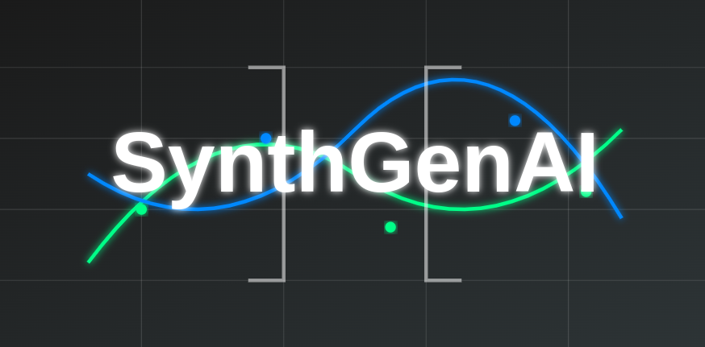

# SynthGenAI-Package for Generating Synthetic Datasets using LLMs



SynthGenAI is a package for generating Synthetic Datasets. The idea is to have a tool which is simple to use and can generate datasets on different topics by utilizing LLMs from different API providers. The package is designed to be modular and can be easily extended to include some different API providers for LLMs and new features.

> [!IMPORTANT]
> The package is still in the early stages of development and some features may not be fully implemented or tested. If you find any issues or have any suggestions, feel free to open an issue or create a pull request.

## Why SynthGenAI now? 🤔

Interest in synthetic data generation has surged recently, driven by the growing recognition of data as a critical asset in AI development. As [Ilya Sutskever](https://youtu.be/1yvBqasHLZs), one of the most important figures in AI, says: 'Data is the fossil fuel of AI.' The more quality data we have, the better our models can perform. However, access to data is often restricted due to privacy concerns, or it may be prohibitively expensive to collect. Additionally, the vast amount of high-quality data on the internet has already been extensively mined. Synthetic data generation addresses these challenges by allowing us to create diverse and useful datasets using current pre-trained Large Language Models (LLMs). Beyond LLMs, synthetic data also holds immense potential for pre-training and post-training of Small Language Models (SLMs), which are gaining popularity due to their efficiency and suitability for specific, resource-constrained applications. By leveraging synthetic data for both LLMs and SLMs, we can enhance performance across a wide range of use cases while balancing resource efficiency and model effectiveness. This approach enables us to harness the strengths of both synthetic and authentic datasets to achieve optimal outcomes.

## Tools used for building SynthGenAI 🧰

The package is built using Python and the following libraries:

- [uv](https://docs.astral.sh/uv/), An extremely fast Python package and project manager, written in Rust.
- [LiteLLM](https://docs.litellm.ai/docs/), A Python SDK for accessing LLMs from different API providers with standardized OpenAI Format.
- [Langfuse](https://langfuse.com/), LLMOps platform for observability, tracebility and monitoring of LLMs.
- [Pydantic](https://pydantic-docs.helpmanual.io/), Data validation and settings management using Python type annotations.
- [Huggingface Hub](https://huggingface.co/) & [Datasets](https://huggingface.co/docs/datasets/), A Python library for saving generated datasets on Hugging Face Hub.

## Installation 🛠️

To install the package, you can use the following command:

```bash
pip install synthgenai
```

or if you want to use uv package manager, you can use the following command:

```bash
uv add synthgenai
```

or you can install the package directly from the source code using the following commands:

```bash
git clone https://github.com/Shekswess/synthgenai.git
uv build
pip install ./dist/synthgenai-{version}-py3-none-any.whl
```

### Requirements 📋

To use the package, you need to have the following requirements installed:

- [Python 3.10+](https://www.python.org/downloads/)
- [uv](https://docs.astral.sh/uv/) for building the package directly from the source code
- [Ollama](https://ollama.com/) running on your local machine if you want to use Ollama as an API provider (optional)
- [Langfuse](https://langfuse.com/) running on your local machine or in the cloud if you want to use Langfuse for tracebility (optional)
- [Hugging Face Hub](https://huggingface.co/) account if you want to save the generated datasets on Hugging Face Hub with generated token (optional)
- [Gradio](https://gradio.app/) for using the SynthGenAI UI (optional)

## Quick Start 🚀

After installation, get started quickly by using the CLI:

```bash
# 1. See what environment variables you need
synthgenai env-setup

# 2. Set up your API keys (example for OpenAI)
export OPENAI_API_KEY="your-api-key-here"

# 3. # List available dataset types
synthgenai list-types

# 4. Generate your first dataset
synthgenai generate instruction \
  --model "openai/gpt-5" \
  --topic "Python Programming" \
  --domain "Software Development" \
  --entries 100

# 5. See more examples
synthgenai examples
```

### Available Commands

- `synthgenai generate` - Generate synthetic datasets
- `synthgenai list-types` - Show all available dataset types
- `synthgenai examples` - Display example commands
- `synthgenai providers` - List supported LLM providers
- `synthgenai env-setup` - Show environment setup guide
- `synthgenai --help` - Show help information

## Usage 👨‍💻

### Supported API Providers 💪

- [x] [Groq](https://groq.com/) - more info about Groq models that can be used, can be found [here](https://docs.litellm.ai/docs/providers/groq)
- [x] [Mistral AI](https://mistral.ai/) - more info about Mistral AI models that can be used, can be found [here](https://docs.litellm.ai/docs/providers/mistral-ai)
- [x] [Gemini](https://gemini.google.com/) - more info about Gemini models that can be used, can be found [here](https://docs.litellm.ai/docs/providers/gemini)
- [x] [Bedrock](https://aws.amazon.com/bedrock) - more info about Bedrock models that can be used, can be found [here](https://docs.litellm.ai/docs/providers/bedrock)
- [x] [Anthropic](https://www.anthropic.com/) - more info about Anthropic models that can be used, can be found [here](https://docs.litellm.ai/docs/providers/anthropic)
- [x] [OpenAI](https://openai.com) - more info about OpenAI models that can be used, can be found [here](https://docs.litellm.ai/docs/providers/openai)
- [x] [Hugging Face](https://huggingface.co/) - more info about Hugging Face models that can be used, can be found [here](https://docs.litellm.ai/docs/providers/hugging-face)
- [x] [Ollama](https://ollama.com/) - more info about Ollama models that can be used, can be found [here](https://docs.litellm.ai/docs/providers/ollama)
- [x] [vLLM](https://vllm.ai/) - more info about vLLM models that can be used, can be found [here](https://docs.litellm.ai/docs/providers/vllm)
- [x] [SageMaker](https://aws.amazon.com/sagemaker/) - more info about SageMaker models that can be used, can be found [here](https://docs.litellm.ai/docs/providers/aws_sagemaker)
- [x] [Azure](https://azure.microsoft.com/en-us/services/machine-learning/) - more info about Azure and Azure AI models that can be used, can be found [here](https://docs.litellm.ai/docs/providers/azure) & [here](https://docs.litellm.ai/docs/providers/azure_ai)
- [x] [Vertex AI](https://cloud.google.com/vertex-ai) - more info about Vertex AI models that can be used, can be found [here](https://docs.litellm.ai/docs/providers/vertex)
- [x] [DeepSeek](https://www.deepseek.com/) - more info about DeepSeek models that can be used, can be found [here](https://docs.litellm.ai/docs/providers/deepseek)
- [x] [xAI](https://x.ai/) - more info about xAI models that can be used, can be found [here](https://docs.litellm.ai/docs/providers/xai)
- [x] [OpenRouter](https://openrouter.ai/) - more info about OpenRouter models that can be used, can be found [here](https://docs.litellm.ai/docs/providers/openrouter)

### Environment Setup & Configuration 🔐

For detailed information about setting up environment variables for different API providers, observability tools, and dataset management, please refer to the [Installation Guide](./docs/installation/index.md#environment-variables-configuration-).

#### Logging Configuration

You can control the logging verbosity using the `SYNTHGENAI_DETAILED_MODE` environment variable:

```bash
# For detailed logging (shows all debug information)
export SYNTHGENAI_DETAILED_MODE="false"

# For NO logging (default)
export SYNTHGENAI_DETAILED_MODE="true"
```

> [!NOTE]
> By default, `SYNTHGENAI_DETAILED_MODE` is set to `"true"`, which provides NO logging output. Set it to `"false"` to enable detailed debugging information during dataset generation.

### Observability & Saving Datasets 📊

For observing the generated datasets, you can use **Langfuse** for tracebility and monitoring of the LLMs.

For handling the datasets and saving them on **Hugging Face Hub**, you can use the **Hugging Face Datasets** library.

Currently there are six types of datasets that can be generated using SynthGenAI:

- **Raw Datasets**
- **Instruction Datasets**
- **Preference Datasets**
- **Sentiment Analysis Datasets**
- **Summarization Datasets**
- **Text Classification Datasets**

The datasets can be generated:

- **Synchronously** - each dataset entry is generated one by one
- **Asynchronously** - batch of dataset entries is generated at once

> [!NOTE]
> Asynchronous generation is faster than synchronous generation, but some of LLM providers can have limitations on the number of tokens that can be generated at once.

#### More Examples 📖

More examples with different combinations of LLM API providers and dataset configurations can be found in the [examples](./examples) directory.

> [!IMPORTANT]
> Sometimes the generation of the keywords for the dataset and the dataset entries can fail due to the limitation of the LLM to generate JSON Object as output (this is handled by the package). That's why it is recommended to use models that are capable of generating JSON Objects (structured output). List of models that can generate JSON Objects can be found [here](https://github.com/BerriAI/litellm/blob/main/model_prices_and_context_window.json).

## Generated Datasets 📚

Examples of generated synthetic datasets can be found on the [SynthGenAI Datasets Collection](https://huggingface.co/collections/Shekswess/synthgenai-datasets-6764ad878718b1e567653022) on Hugging Face Hub.

## Contributing 🤝

If you want to contribute to this project and make it better, your help is very welcome. Create a pull request with your changes and I will review it. If you have any questions, open an issue.

## License 📝

This project is licensed under the MIT License - see the LICENSE.md file for details.

## Repo Structure 📂

```
.
├── .github/                                                      # GitHub configuration files and workflows
│   ├── workflows/                                                # GitHub Actions workflows
│   │   ├── build_n_publish.yaml                                  # Build and publish workflow
│   │   ├── docs.yaml                                             # Documentation deployment workflow
│   │   └── uv-ci.yaml                                            # CI workflow using uv (pre-commit + unit tests)
│   └── depandabot.yml                                            # Dependabot configuration file
├── docs
│   ├── assets
│   │   ├── favicon.png
│   │   ├── logo_header.png
│   │   └── logo.svg
│   ├── configurations
│   │   ├── dataset_configuration.md
│   │   ├── dataset_generator_configuration.md
│   │   ├── index.md
│   │   └── llm_configuration.md
│   ├── contributing
│   │   └── index.md
│   ├── datasets
│   │   ├── index.md
│   │   ├── instruction_datasets.md
│   │   ├── preference_datasets.md
│   │   ├── raw_datasets.md
│   │   ├── sentiment_analysis_datasets.md
│   │   ├── summarization_datasets.md
│   │   └── text_classification_datasets.md
│   ├── examples
│   │   └── index.md
│   ├── index.md
│   ├── installation
│   │   └── index.md
│   ├── llm_providers
│   │   └── index.md
│   ├── quick_start
│   │   └── index.md
│   └── stylesheets
├── examples
│   ├── anthropic_instruction_dataset_example.py
│   ├── azure_ai_preference_dataset_example.py
│   ├── azure_summarization_dataset_example.py
│   ├── bedrock_raw_dataset_example.py
│   ├── deepseek_instruction_dataset_example.py
│   ├── gemini_langfuse_raw_dataset_example.py
│   ├── groq_preference_dataset_example.py
│   ├── huggingface_instruction_dataset_example.py
│   ├── mistral_preference_dataset_example.py
│   ├── ollama_preference_dataset_example.py
│   ├── openai_raw_dataset_example.py
│   ├── openrouter_raw_dataset_example.py
│   ├── sagemaker_summarization_dataset_example.py
│   ├── vertex_ai_text_classification_dataset_example.py
│   ├── vllm_sentiment_analysis_dataset_example.py
│   └── xai_raw_dataset_example.py
├── synthgenai
│   ├── dataset
│   │   ├── __init__.py
│   │   ├── base_dataset.py
│   │   └── dataset.py
│   ├── dataset_genetors
│   │   ├── __init__.py
│   │   ├── classification_dataset_generator.py
│   │   ├── dataset_generator.py
│   │   ├── instruction_dataset_generator.py
│   │   ├── preference_dataset_generator.py
│   │   ├── raw_dataset_generator.py
│   │   ├── sentiment_dataset_generator.py
│   │   └── summarization_dataset_generator.py
│   ├── llm
│   │   ├── __init__.py
│   │   ├── base_llm.py
│   │   └── llm.py
│   ├── prompts
│   │   ├── description_system_prompt
│   │   ├── description_user_prompt
│   │   ├── entry_classification_system_prompt
│   │   ├── entry_instruction_system_prompt
│   │   ├── entry_preference_system_prompt
│   │   ├── entry_raw_system_prompt
│   │   ├── entry_sentiment_system_prompt
│   │   ├── entry_summarization_system_prompt
│   │   ├── entry_user_prompt
│   │   ├── keyword_system_prompt
│   │   ├── keyword_user_prompt
│   │   ├── labels_system_prompt
│   │   └── labels_user_prompt
│   ├── schemas
│   │   ├── __init__.py
│   │   ├── config.py
│   │   ├── datasets.py
│   │   ├── enums.py
│   │   └── messages.py
│   ├── utils
│   |   ├── file_utils.py
│   |   ├── __init__.py
│   |   ├── json_utils.py
│   |   ├── progress_utils.py
│   |   ├── prompt_utils.py
│   |   ├── text_utils.py
│   |   └── yaml_utils.py
│   ├── __init__.py
│   └── cli.py
├── tests
│   ├── __init__.py
│   ├── conftest.py
│   ├── test_dataset_generator.py
│   ├── test_dataset.py
│   └── test_llm.py
├── .gitignore
├── .pre-commit-config.yaml
├── .python-version
├── LICENCE.txt
├── mkdocs.yml
├── pyproject.toml
├── README.md
└── uv.lock
```
